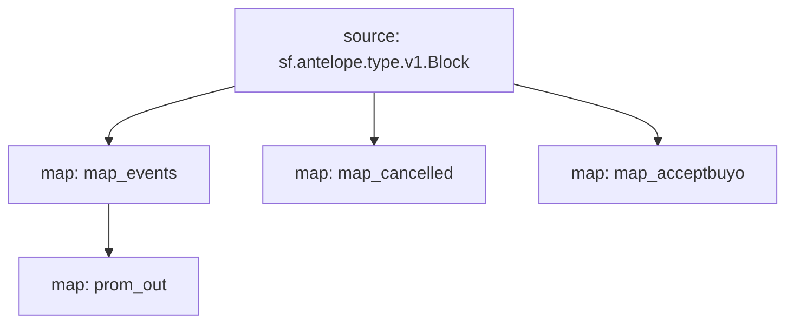

# Atomicmarket sales powered by **Substreams**

This substreams is meant to retrieve data in order to build market volume charts for collections of NFTs in the atomicmarket ecosystem.

## Quick Start

```bash
make run 
```

### Mermaid graph


### Modules
```yaml
Package name: atomicmarketsales
Version: v0.1.0
Modules:
----
Name: map_events
Initial block: 0
Kind: map
Output Type: proto:antelope.atomicmarketsales.v1.AssertSaleEvents
Hash: 032864daaf1ecd0a7e3e4582dae8539814314ac4

Name: map_cancelled
Initial block: 0
Kind: map
Output Type: proto:antelope.atomicmarketsales.v1.CancelSaleEvents
Hash: 26e94d2fb9e1acce0db1ec1bae28e34f4ec1b1f2

Name: map_acceptbuyo
Initial block: 0
Kind: map
Output Type: proto:antelope.atomicmarketsales.v1.AcceptbuyoEvents
Hash: 45f4c93683fede44601359a4c6c08b1efaed1e53

Name: prom_out
Initial block: 0
Kind: map
Output Type: proto:pinax.substreams.sink.prometheus.v1.PrometheusOperations
Hash: a849ff919e150a3e08f978d10a3dffa31dc1d5c6
```