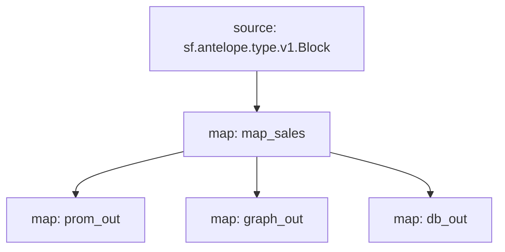

# Atomicmarket sales powered by **Substreams**

[](https://github.com/pinax-network/substreams-atomicmarket-sales/actions/workflows/test.yml)


> Sale ID, Transaction ID, Asset IDs, Listing price & Collection name

## Quick Start

```
gh repo clone pinax-network/substreams-atomicmarket-sales
cd substreams-atomicmarket-sales
make
make gui        # runs the map_sales module for a block
```

### Mermaid graph


## Map Outputs

### `graph_out`

```json
{
  "entityChanges": [
      {
        "entity": "Sales",
        "id": "2321191",
        "operation": "OPERATION_CREATE",
        "fields": [
          {
            "name": "sale_id",
            "newValue": {
              "bigint": "2321191"
            }
          },
          {
            "name": "listing_price_symcode",
            "newValue": {
              "string": "USD"
            }
          },
          {
            "name": "listing_price_precision",
            "newValue": {
              "bigint": "2"
            }
          },
          {
            "name": "collection_name",
            "newValue": {
              "string": "chessunivers"
            }
          },
          {
            "name": "trx_id",
            "newValue": {
              "string": "b70bfe7ddea07a0be32991684fff17d6d74825e905b785e43be236845779f318"
            }
          },
          {
            "name": "asset_ids",
            "newValue": {
              "array": {
                "value": [
                  {
                    "string": "2199025056631"
                  }
                ]
              }
            }
          },
          {
            "name": "listing_price_amount",
            "newValue": {
              "bigint": "4"
            }
          }
        ]
      },
    ...
  ]
}
  
```

### Modules
```yaml
Package name: atomicmarketsales
Version: v0.2.2
Modules:
----
Name: map_sales
Initial block: 0
Kind: map
Output Type: proto:antelope.atomicmarketsales.v1.AssertSaleEvents
Hash: a7c2d99723c69bf2386c0c1572646c17d48ebc20

Name: prom_out
Initial block: 0
Kind: map
Output Type: proto:pinax.substreams.sink.prometheus.v1.PrometheusOperations
Hash: f1526acf76bd2898e73c625f1ff320dcdd6afe0c

Name: graph_out
Initial block: 0
Kind: map
Output Type: proto:sf.substreams.sink.entity.v1.EntityChanges
Hash: 81b5b4db2086cc4504d303c32121db9feb66aaf4

Name: db_out
Initial block: 0
Kind: map
Output Type: proto:sf.substreams.sink.database.v1.DatabaseChanges
Hash: 7fea1c8148572b3289aa627d3d515d39bf8d62ba
```