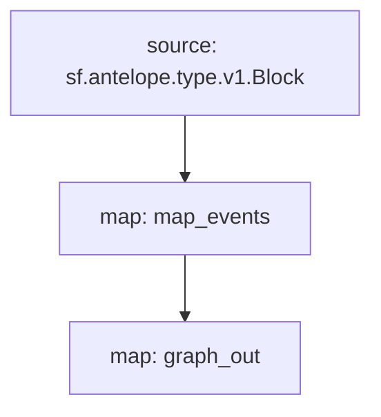

# `Atomicmarket` powered by **Substreams**

[](https://github.com/pinax-network/substreams-atomicmarket/actions/workflows/test.yml)


> Sales related events: AnnounceSale, AnnounceAuction, NewBuyOffer, PurchaseSale, NewSale, AssertSale

## Quick Start

```
make
make gui
```

### Mermaid graph


## Map Outputs

### `map_events`

```json
{
  "items": [
    {
      "assertSale": {
        "trxId": "b70bfe7ddea07a0be32991684fff17d6d74825e905b785e43be236845779f318",
        "saleId": "2319916",
        "seller": "ghaterruuwwu",
        "assetIds": ["2199025081834"],
        "offerId": "2324267",
        "listingPrice": "0.2079 EOS",
        "settlementSymbol": "4,EOS",
        "collectionName": "chessunivers",
        "collectionFee": "0.08000000000000000"
      }
    },
    {
      "purchaseSale": {
        "trxId": "b70bfe7ddea07a0be32991684fff17d6d74825e905b785e43be236845779f318",
        "buyer": "knottsy1.ftw",
        "saleId": "2319916"
      }
    }
    ...
  ]
}
```

### Modules
```yaml
Package name: atomicmarket
Version: v0.3.2
Doc: Substreams for AtomicMarket
Modules:
----
Name: map_events
Initial block: 0
Kind: map
Output Type: proto:antelope.atomicmarket.v1.AnyEvents
Hash: 07452073c9c51edc6996f620b39f266511505816

Name: graph_out
Initial block: 0
Kind: map
Output Type: proto:sf.substreams.sink.entity.v1.EntityChanges
Hash: d2c0bcf1d4641dafb70c3ff43e73ce8fa1afff98
```