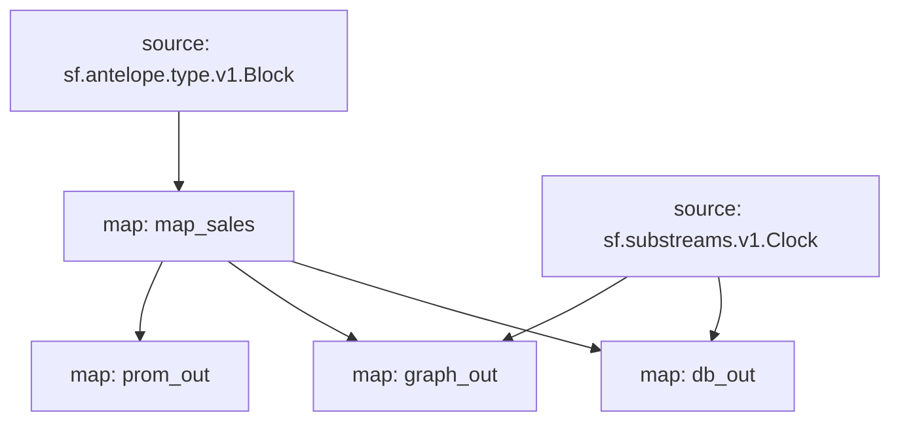

# Atomicmarket sales powered by **Substreams**

This substreams is meant to retrieve data in order to build market volume charts for collections of NFTs in the atomicmarket ecosystem.

## Quick Start

```bash
make run        # runs the map_sales module for a block
make prometheus # runs the prom_out module for a block
make graph_out  # runs the graph_out module for a block
make db_out     # runs the db_out module for a block
make sink
```
The `make sink` command will dump `atomicmarket` `assertsale` events from the 1st of Aug to 1st of Sep 2023 on the EOS mainnet into a Redis TimeSeries database.

### Mermaid graph


### Modules
```yaml
Package name: atomicmarketsales
Version: v0.1.4
Modules:
----
Name: map_sales
Initial block: 0
Kind: map
Output Type: proto:antelope.atomicmarketsales.v1.AssertSaleEvents
Hash: 0b1b8e96b584c6c7bc814af7a12b5f947edb2b44

Name: prom_out
Initial block: 0
Kind: map
Output Type: proto:pinax.substreams.sink.prometheus.v1.PrometheusOperations
Hash: db18e04b341d6b6e6a70f13acef1e5a63537f552

Name: graph_out
Initial block: 0
Kind: map
Output Type: proto:sf.substreams.sink.entity.v1.EntityChanges
Hash: 02532c3db438ed030564a0d0a0f33577e366e1bb

Name: db_out
Initial block: 0
Kind: map
Output Type: proto:sf.substreams.sink.database.v1.DatabaseChanges
Hash: ddeeea4ae09e6204fe095ce444c09510ac576474
```