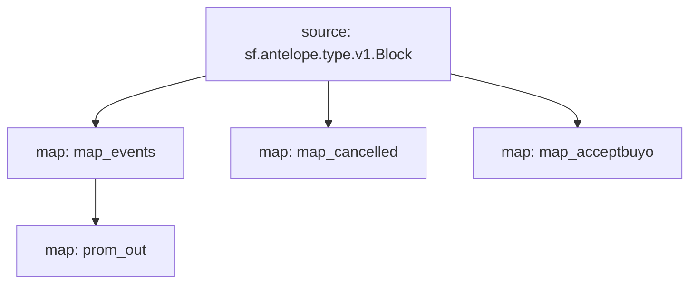

# Atomicmarket sales powered by **Substreams**

This substreams is meant to retrieve data in order to build market volume charts for collections of NFTs in the atomicmarket ecosystem.

## Quick Start

```bash
make run 
make sink
```
The `make sink` command will dump `atomicmarket` `assertsale` events from the 1st of Aug to 1st of Sep 2023 on the EOS mainnet into a Redis TimeSeries database.

### Mermaid graph


### Modules
```yaml
Package name: atomicmarketsales
Version: v0.1.0
Modules:
----
Name: map_events
Initial block: 0
Kind: map
Output Type: proto:antelope.atomicmarketsales.v1.AssertSaleEvents
Hash: 9871bbb16dcdea5a23184074036ab7cb9ef6b5fb

Name: map_cancelled
Initial block: 0
Kind: map
Output Type: proto:antelope.atomicmarketsales.v1.CancelSaleEvents
Hash: b2b03e8849e97b76bec5226f822c1e81a5880d3c

Name: map_acceptbuyo
Initial block: 0
Kind: map
Output Type: proto:antelope.atomicmarketsales.v1.AcceptbuyoEvents
Hash: 1805b63804d82e424477641c451e775ebd69a63d

Name: prom_out
Initial block: 0
Kind: map
Output Type: proto:pinax.substreams.sink.prometheus.v1.PrometheusOperations
Hash: 4b5bf1717023b962799743fb5fefc8fd56c9526b
```