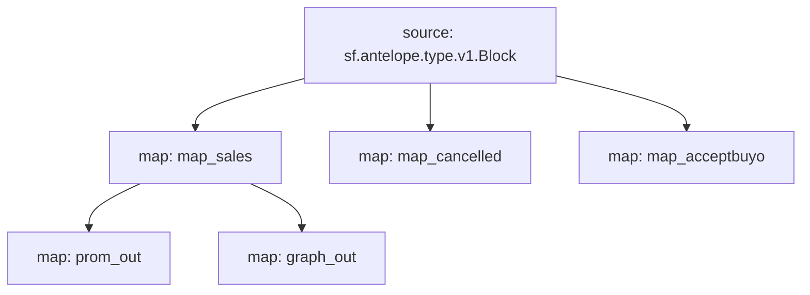

# Atomicmarket sales powered by **Substreams**

This substreams is meant to retrieve data in order to build market volume charts for collections of NFTs in the atomicmarket ecosystem.

## Quick Start

```bash
make run # runs the map_sales module for a block
make prometheus # runs the prom_out module for a block
make graph_out # runs the graph_out module for a block
make sink
```
The `make sink` command will dump `atomicmarket` `assertsale` events from the 1st of Aug to 1st of Sep 2023 on the EOS mainnet into a Redis TimeSeries database.

### Mermaid graph


### Modules
```yaml
Package name: atomicmarketsales
Version: v0.1.3
Modules:
----
Name: map_sales
Initial block: 0
Kind: map
Output Type: proto:antelope.atomicmarketsales.v1.AssertSaleEvents
Hash: f3b0c6648008c8e55cc3e80feb2953789ba62035

Name: map_cancelled
Initial block: 0
Kind: map
Output Type: proto:antelope.atomicmarketsales.v1.CancelSaleEvents
Hash: a45c35b8c288378e1b0fe3d0d56fdac334be5469

Name: map_acceptbuyo
Initial block: 0
Kind: map
Output Type: proto:antelope.atomicmarketsales.v1.AcceptbuyoEvents
Hash: a378e231692bd9d452ec24eeea23ec542174671f

Name: prom_out
Initial block: 0
Kind: map
Output Type: proto:pinax.substreams.sink.prometheus.v1.PrometheusOperations
Hash: 81e3b6e9a680389e0ebb061d3abe95f78428f03c

Name: graph_out
Initial block: 0
Kind: map
Output Type: proto:sf.substreams.sink.entity.v1.EntityChanges
Hash: 6fd8f13095c30d1fe3396844761575dfed285586
```