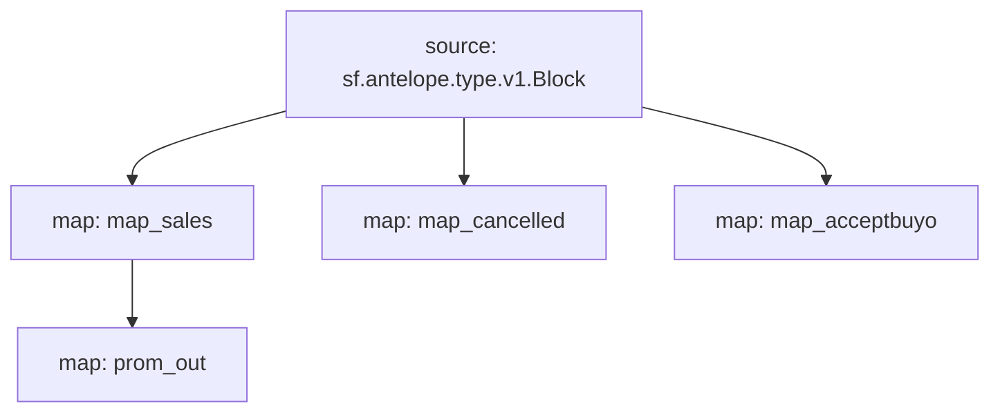

# Atomicmarket sales powered by **Substreams**

This substreams is meant to retrieve data in order to build market volume charts for collections of NFTs in the atomicmarket ecosystem.

## Quick Start

```bash
make run 
make sink
```
The `make sink` command will dump `atomicmarket` `assertsale` events from the 1st of Aug to 1st of Sep 2023 on the EOS mainnet into a Redis TimeSeries database.

### Mermaid graph


### Modules
```yaml
Package name: atomicmarketsales
Version: v0.1.2
Modules:
----
Name: map_sales
Initial block: 0
Kind: map
Output Type: proto:antelope.atomicmarketsales.v1.AssertSaleEvents
Hash: 6d058e9e37bdede78e8fee0cd78b525c55506713

Name: map_cancelled
Initial block: 0
Kind: map
Output Type: proto:antelope.atomicmarketsales.v1.CancelSaleEvents
Hash: caba5f4c38747b2b5b68067f70a17c3cf020a48c

Name: map_acceptbuyo
Initial block: 0
Kind: map
Output Type: proto:antelope.atomicmarketsales.v1.AcceptbuyoEvents
Hash: b9cdf01fdbeadb1232a19e1bcf1f23b7f6fed1e9

Name: prom_out
Initial block: 0
Kind: map
Output Type: proto:pinax.substreams.sink.prometheus.v1.PrometheusOperations
Hash: e0baf7151d79e65920066ff49a0ce5b8e8231788
```