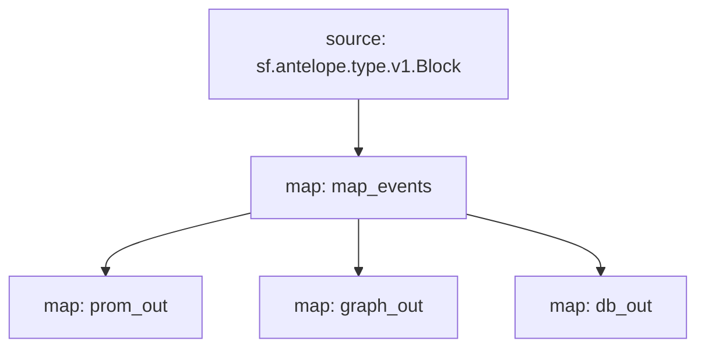

# `Atomicmarket` powered by **Substreams**

[](https://github.com/pinax-network/substreams-atomicmarket/actions/workflows/test.yml)


> Sale events: Sale ID, Transaction ID, Asset IDs, Listing price & Collection name

## Quick Start

```
gh repo clone pinax-network/substreams-atomicmarket
cd substreams-atomicmarket
make
make gui        # runs the map_events module for a block
```

### Mermaid graph


## Map Outputs

### `graph_out`

```json
{
  "entityChanges": [
      {
        "entity": "Sales",
        "id": "2321191",
        "operation": "OPERATION_CREATE",
        "fields": [
          {
            "name": "sale_id",
            "newValue": {
              "bigint": "2321191"
            }
          },
          {
            "name": "listing_price_symcode",
            "newValue": {
              "string": "USD"
            }
          },
          {
            "name": "listing_price_precision",
            "newValue": {
              "bigint": "2"
            }
          },
          {
            "name": "collection_name",
            "newValue": {
              "string": "chessunivers"
            }
          },
          {
            "name": "trx_id",
            "newValue": {
              "string": "b70bfe7ddea07a0be32991684fff17d6d74825e905b785e43be236845779f318"
            }
          },
          {
            "name": "asset_ids",
            "newValue": {
              "array": {
                "value": [
                  {
                    "string": "2199025056631"
                  }
                ]
              }
            }
          },
          {
            "name": "listing_price_amount",
            "newValue": {
              "bigint": "4"
            }
          },
          {
            "name": "listing_price_value",
            "newValue": {
              "string": "0.04"
            }
          }
        ]
      },
    ...
  ]
}
  
```

### Modules
```yaml
Package name: atomicmarket
Version: v0.3.0
Doc: Substreams for AtomicMarket
Modules:
----
Name: map_events
Initial block: 0
Kind: map
Output Type: proto:antelope.atomicmarket.v1.AnyEvents
Hash: 5a5501f1620f3ae6025343497b917deae5044903

Name: prom_out
Initial block: 0
Kind: map
Output Type: proto:pinax.substreams.sink.prometheus.v1.PrometheusOperations
Hash: 6feb9acab35c3b1b9ac7116535fffbb83d919200

Name: graph_out
Initial block: 0
Kind: map
Output Type: proto:sf.substreams.sink.entity.v1.EntityChanges
Hash: 8d94d569565710b3556de2d382adda44960ac2c9

Name: db_out
Initial block: 0
Kind: map
Output Type: proto:sf.substreams.sink.database.v1.DatabaseChanges
Hash: b6eb6c8b7ec383c8d07ca4f71f8f09a8b9a1fc2f
```