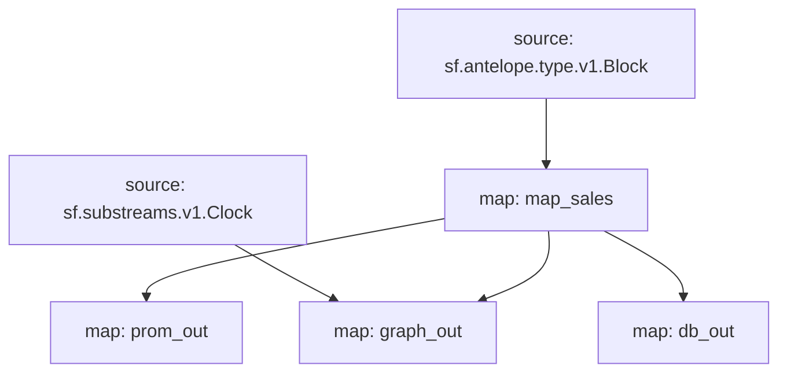

# Atomicmarket sales powered by **Substreams**

[](https://github.com/pinax-network/substreams-atomicmarket-sales/actions/workflows/test.yml)


> Sale ID, Transaction ID, Asset IDs, Listing price & Collection name

## Quick Start

```
gh repo clone pinax-network/substreams-atomicmarket-sales
cd substreams-atomicmarket-sales
make
make gui        # runs the map_sales module for a block
```

### Mermaid graph


## Map Outputs

### `graph_out`

```json
{
  "entityChanges": [
    {
      "entity": "AssertSale",
      "id": "2321191",
      "operation": "OPERATION_CREATE",
      "fields": [
        {
          "name": "sale_id",
          "newValue": {
            "bigint": "2321191"
          }
        },
        {
          "name": "timestamp",
          "newValue": {
            "string": "1690942290"
          }
        },
        {
         "name": "listing_price",
          "newValue": {
            "string": "0.04 USD"
          }
        },
        {
          "name": "trx_id",
          "newValue": {
            "string": "b70bfe7ddea07a0be32991684fff17d6d74825e905b785e43be236845779f318"
          }
        },
        {
          "name": "asset_ids",
          "newValue": {
            "array": {
              "value": [
                {
                  "string": "2199025056631"
                }
              ]
            }
          }
        },
        {
          "name": "collection_name",
          "newValue": {
            "string": "chessunivers"
          }
        }
      ]
    },
    ...
  ]
}
  
```

### Modules
```yaml
Package name: atomicmarketsales
Version: v0.2.0
Modules:
----
Name: map_sales
Initial block: 0
Kind: map
Output Type: proto:antelope.atomicmarketsales.v1.AssertSaleEvents
Hash: fd4a5fc9a395ef7bc382f6799e140d3153d199c6

Name: prom_out
Initial block: 0
Kind: map
Output Type: proto:pinax.substreams.sink.prometheus.v1.PrometheusOperations
Hash: 721de95cfdc322e0b2d086e7a3f5c193104f833a

Name: graph_out
Initial block: 0
Kind: map
Output Type: proto:sf.substreams.sink.entity.v1.EntityChanges
Hash: bb53da87a836ccd09cde4253fff4f14a2dff4389

Name: db_out
Initial block: 0
Kind: map
Output Type: proto:sf.substreams.sink.database.v1.DatabaseChanges
Hash: 5591f6e1e4bb15db5b61c6dc4acf3fd2ae53903e
```